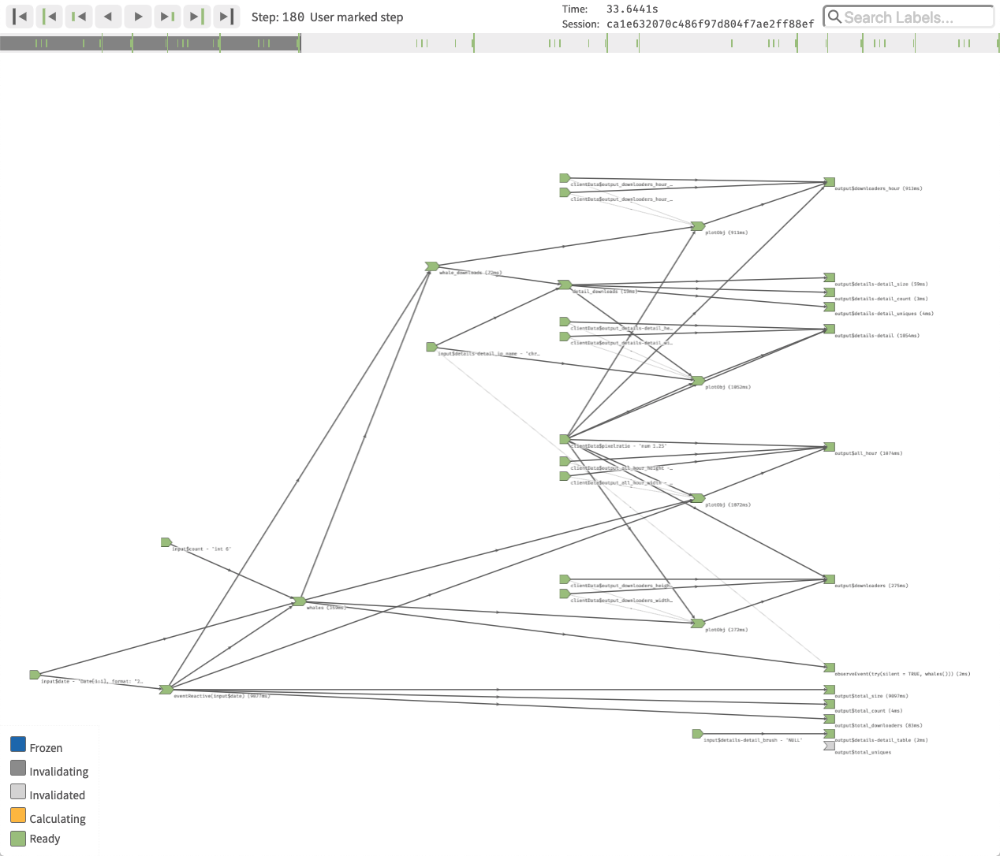

# reactlog

[](https://travis-ci.org/rstudio/reactlog)
<!-- [](https://codecov.io/github/rstudio/reactlog?branch=master) -->
[](https://cran.r-project.org/package=reactlog)


[Shiny](http://shiny.rstudio.com/) is an R package from RStudio that makes it incredibly easy to build interactive web applications with R.  The complexity of the reactive elements within a Shiny application can quickly become intertwined and are difficult to debug.  **reactlog** provides a visual insight into the _black box_ of Shiny reactivity.  After logging the reactive interactions of a Shiny application, **reactlog** constructs a directed dependency graph of the Shiny's reactive state at any time point in the record.

The **reactlog** dependency graph provides users with the ability to visually see if reactive elements are:
* not utilized (never retrieved)
* over utilized (called independently many times)
* interacting with unexpected elements
* invalidating all expected dependencies
* freezing (and thawing), preventing triggering of future reactivity

<!-- For an introduction and examples, visit the [Shiny Dev Center](http://shiny.rstudio.com/). -->


## Major Features

* Display the reactivity dependency graph of your Shiny applications
* Move throughout your reactive history to replay element interactions
* Highlight reactive family trees
* Filter on reactive family trees
* Search for reactive elements

## Installation

To install the stable version from CRAN, run the following from an R console:

```r
install.packages("reactlog")
```

For the latest version:

```r
remotes::install_github("rstudio/reactlog")
```

## Usage


```r
library(shiny)
library(reactlog)

# tell shiny to log all reactivity
options(shiny.reactlog = TRUE)

# run a shiny app
app <- system.file("examples/01_hello", package = "shiny")
runApp(app)

# once app has closed, display reactlog from shiny
shiny::showReactLog()
```

Or while your Shiny app is running, press the key combination `Ctrl+F3` (Mac: `Cmd+F3`) to launch the **reactlog** application.

To mark a specific execution time point within your Shiny app, press the key combination `Ctrl+F4` (Mac: `Cmd+F4`). This will highlight a specific point in time in your reactlog.


#### Example

Example snapshot of a reactlog graph from the synchronous [`cranwhales`](https://github.com/rstudio/cranwhales) Shiny application.

[Live demo](https://rstudio.github.io/reactlog/demo/reactlog.html) of a [`cranwhales`](https://github.com/rstudio/cranwhales) reactlog with one user-marked step.

[](https://rstudio.github.io/reactlog/demo/reactlog.html)


## Help

If you have general questions about using **reactlog**, please use the [RStudio Community website](https://community.rstudio.com/c/shiny). For bug reports, please use the **reactlog** [issue tracker](https://github.com/rstudio/reactlog/issues).


## Development

Please make sure you have [Node.js](https://nodejs.org/en/) and [yarn](https://yarnpkg.com/en/docs/install) installed.

Installation script:

```bash
# install dependencies and build JavaScript
yarn install

# build on file change
yarn watch
```

By changing the file `'./inst/reactlog/defaultLog.js'` with the contents of any log file in `'./inst/log-files/'`, different default log files can be loaded.  Once the local JavaScript (`'./inst/reactlog/reactlogAsset/reactlog.js'`) has been built with `yarn build` or `yarn watch`, refresh `'./inst/reactlog/reactlog.html'` to avoid constantly spawning Shiny applications for testing.


## Guidelines for contributing

We welcome contributions to the **reactlog** package. Please see our [CONTRIBUTING.md](.github/CONTRIBUTING.md) file for detailed guidelines of how to contribute.

Please note that the **reactlog** project is released with a [Contributor Code of Conduct](.github/CODE_OF_CONDUCT.md). By contributing to this project, you agree to abide by its terms.
