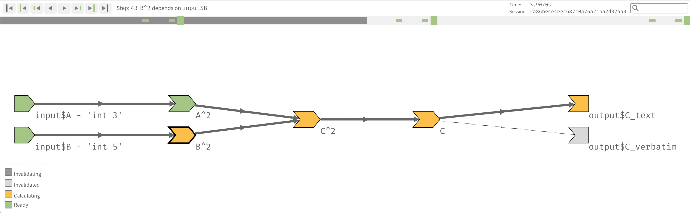
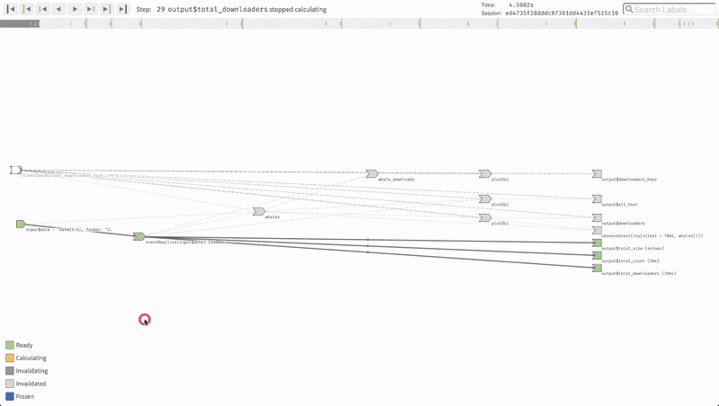

# reactlog

[![RStudio Community: Shiny](https://img.shields.io/badge/Community%20Support-Shiny-75aadb.svg?style=popout&logo=data:image/svg+xml;base64,PD94bWwgdmVyc2lvbj0iMS4wIiBlbmNvZGluZz0idXRmLTgiPz4KPCEtLSBHZW5lcmF0b3I6IEFkb2JlIElsbHVzdHJhdG9yIDIyLjEuMCwgU1ZHIEV4cG9ydCBQbHVnLUluIC4gU1ZHIFZlcnNpb246IDYuMDAgQnVpbGQgMCkgIC0tPgo8c3ZnIHZlcnNpb249IjEuMSIgeG1sbnM9Imh0dHA6Ly93d3cudzMub3JnLzIwMDAvc3ZnIiB4bWxuczp4bGluaz0iaHR0cDovL3d3dy53My5vcmcvMTk5OS94bGluayIgeD0iMHB4IiB5PSIwcHgiCgkgdmlld0JveD0iMCAwIDYyNS45IDYyNS45IiBzdHlsZT0iZW5hYmxlLWJhY2tncm91bmQ6bmV3IDAgMCA2MjUuOSA2MjUuOTsiIHhtbDpzcGFjZT0icHJlc2VydmUiPgo8c3R5bGUgdHlwZT0idGV4dC9jc3MiPgoJLnN0MHtmaWxsOiM3NUFBREI7fQoJLnN0MXtmaWxsOiM0RDRENEQ7fQoJLnN0MntmaWxsOiNGRkZGRkY7fQoJLnN0M3tmaWxsOnVybCgjU1ZHSURfMV8pO30KCS5zdDR7ZmlsbDp1cmwoI1NWR0lEXzJfKTt9Cgkuc3Q1e2ZpbGw6dXJsKCNTVkdJRF8zXyk7fQoJLnN0NntmaWxsOnVybCgjU1ZHSURfNF8pO30KCS5zdDd7ZmlsbDp1cmwoI1NWR0lEXzVfKTt9Cgkuc3Q4e2ZpbGw6dXJsKCNTVkdJRF82Xyk7fQoJLnN0OXtmaWxsOnVybCgjU1ZHSURfN18pO30KCS5zdDEwe2ZpbGw6dXJsKCNTVkdJRF84Xyk7fQoJLnN0MTF7ZmlsbDp1cmwoI1NWR0lEXzlfKTt9Cgkuc3QxMntmaWxsOnVybCgjU1ZHSURfMTBfKTt9Cgkuc3QxM3tvcGFjaXR5OjAuMTg7ZmlsbDp1cmwoI1NWR0lEXzExXyk7fQoJLnN0MTR7b3BhY2l0eTowLjM7fQo8L3N0eWxlPgo8ZyBpZD0iR3JheV9Mb2dvIj4KPC9nPgo8ZyBpZD0iQmxhY2tfTGV0dGVycyI+CjwvZz4KPGcgaWQ9IkJsdWVfR3JhZGllbnRfTGV0dGVycyI+Cgk8Zz4KCgkJCTxlbGxpcHNlIHRyYW5zZm9ybT0ibWF0cml4KDAuNzA3MSAtMC43MDcxIDAuNzA3MSAwLjcwNzEgLTEyNy45MjY1IDMxNy4wMzE3KSIgY2xhc3M9InN0MCIgY3g9IjMxOC43IiBjeT0iMzEyLjkiIHJ4PSIzMDkuOCIgcnk9IjMwOS44Ii8+CgkJPGc+CgkJCTxwYXRoIGNsYXNzPSJzdDIiIGQ9Ik00MjQuNyw0MTEuOGgzMy42djI2LjFoLTUxLjNMMzIyLDMxMC41aC00NS4zdjEwMS4zaDQ0LjN2MjYuMUgyMDkuNXYtMjYuMWgzOC4zVjE4Ny4zbC0zOC4zLTQuN3YtMjQuNwoJCQkJYzE0LjUsMy4zLDI3LjEsNS42LDQyLjksNS42YzIzLjgsMCw0OC4xLTUuNiw3MS45LTUuNmM0Ni4yLDAsODkuMSwyMSw4OS4xLDcyLjNjMCwzOS43LTIzLjgsNjQuOS02MC43LDc1LjZMNDI0LjcsNDExLjh6CgkJCQkgTTI3Ni43LDI4NS4zbDI0LjMsMC41YzU5LjMsMC45LDgyLjEtMjEuOSw4Mi4xLTUyLjNjMC0zNS41LTI1LjctNDkuNS01OC4zLTQ5LjVjLTE1LjQsMC0zMS4zLDEuNC00OC4xLDMuM1YyODUuM3oiLz4KCQk8L2c+Cgk8L2c+CjwvZz4KPGcgaWQ9IldoaXRlX0xldHRlcnMiPgo8L2c+CjxnIGlkPSJSX0JhbGwiPgo8L2c+Cjwvc3ZnPg==)](https://community.rstudio.com/c/shiny)
[![RStudio Ask a question: reactlog](https://img.shields.io/badge/Ask%20a%20question-reactlog-75aadb.svg?style=popout&logo=data:image/svg+xml;base64,PHN2ZyB4bWxucz0iaHR0cDovL3d3dy53My5vcmcvMjAwMC9zdmciIHhtbG5zOnhsaW5rPSJodHRwOi8vd3d3LnczLm9yZy8xOTk5L3hsaW5rIiB2ZXJzaW9uPSIxLjEiIHg9IjBweCIgeT0iMHB4IiB2aWV3Qm94PSIwIDAgNjI1LjkgNjI1LjkiIHN0eWxlPSJlbmFibGUtYmFja2dyb3VuZDpuZXcgMCAwIDYyNS45IDYyNS45OyIgeG1sOnNwYWNlPSJwcmVzZXJ2ZSI+CjxzdHlsZSB0eXBlPSJ0ZXh0L2NzcyI+Cgkuc3Qwe2ZpbGw6Izc1QUFEQjt9Cgkuc3Qxe2ZpbGw6IzRENEQ0RDt9Cgkuc3Qye2ZpbGw6I0ZGRkZGRjt9Cgkuc3Qze2ZpbGw6dXJsKCNTVkdJRF8xXyk7fQoJLnN0NHtmaWxsOnVybCgjU1ZHSURfMl8pO30KCS5zdDV7ZmlsbDp1cmwoI1NWR0lEXzNfKTt9Cgkuc3Q2e2ZpbGw6dXJsKCNTVkdJRF80Xyk7fQoJLnN0N3tmaWxsOnVybCgjU1ZHSURfNV8pO30KCS5zdDh7ZmlsbDp1cmwoI1NWR0lEXzZfKTt9Cgkuc3Q5e2ZpbGw6dXJsKCNTVkdJRF83Xyk7fQoJLnN0MTB7ZmlsbDp1cmwoI1NWR0lEXzhfKTt9Cgkuc3QxMXtmaWxsOnVybCgjU1ZHSURfOV8pO30KCS5zdDEye2ZpbGw6dXJsKCNTVkdJRF8xMF8pO30KCS5zdDEze29wYWNpdHk6MC4xODtmaWxsOnVybCgjU1ZHSURfMTFfKTt9Cgkuc3QxNHtvcGFjaXR5OjAuMzt9Cjwvc3R5bGU+CjxnIGlkPSJHcmF5X0xvZ28iPgo8L2c+CjxnIGlkPSJCbGFja19MZXR0ZXJzIj4KPC9nPgo8ZyBpZD0iQmx1ZV9HcmFkaWVudF9MZXR0ZXJzIj4KCTxnPgoKCQkJPGVsbGlwc2UgdHJhbnNmb3JtPSJtYXRyaXgoMC43MDcxIC0wLjcwNzEgMC43MDcxIDAuNzA3MSAtMTI3LjkyNjUgMzE3LjAzMTcpIiBjbGFzcz0ic3QwIiBjeD0iMzE4LjciIGN5PSIzMTIuOSIgcng9IjMwOS44IiByeT0iMzA5LjgiLz4KCQk8Zz4KCQkJPHBhdGggY2xhc3M9InN0MiIgZD0iTTQyNC43LDQxMS44aDMzLjZ2MjYuMWgtNTEuM0wzMjIsMzEwLjVoLTQ1LjN2MTAxLjNoNDQuM3YyNi4xSDIwOS41di0yNi4xaDM4LjNWMTg3LjNsLTM4LjMtNC43di0yNC43ICAgICBjMTQuNSwzLjMsMjcuMSw1LjYsNDIuOSw1LjZjMjMuOCwwLDQ4LjEtNS42LDcxLjktNS42YzQ2LjIsMCw4OS4xLDIxLDg5LjEsNzIuM2MwLDM5LjctMjMuOCw2NC45LTYwLjcsNzUuNkw0MjQuNyw0MTEuOHogICAgICBNMjc2LjcsMjg1LjNsMjQuMywwLjVjNTkuMywwLjksODIuMS0yMS45LDgyLjEtNTIuM2MwLTM1LjUtMjUuNy00OS41LTU4LjMtNDkuNWMtMTUuNCwwLTMxLjMsMS40LTQ4LjEsMy4zVjI4NS4zeiIvPgoJCTwvZz4KCTwvZz4KPC9nPgo8ZyBpZD0iV2hpdGVfTGV0dGVycyI+CjwvZz4KPGcgaWQ9IlJfQmFsbCI+CjwvZz4KPC9zdmc+)](https://community.rstudio.com/new-topic?title=&category_id=8&tags=reactlog&body=%0A%0A%0A%20%20--------%0A%20%20%0A%20%20%3Csup%3EReferred%20here%20by%20%60reactlog%60%27s%20README%3C/sup%3E%0A&u=barret)
<br/><!-- single line break only -->
[](https://travis-ci.org/rstudio/reactlog)
[](https://cran.r-project.org/package=reactlog)
[](http://www.rpackages.io/package/reactlog)
[](https://zenodo.org/badge/latestdoi/137799634)
[](https://eslint.org/)
<br/><!-- single line break only -->
[](https://nodejs.org/en/)
[](https://yarnpkg.com/en/)
[](https://github.com/flow-typed/flow-typed)
[](http://js.cytoscape.org/)
[](https://babeljs.io/)
[](https://webpack.js.org/)
[](https://github.com/prettier/prettier)
[](https://eslint.org/)


<!-- [](https://codecov.io/github/rstudio/reactlog?branch=master) -->





[Shiny](http://shiny.rstudio.com/) is an R package from RStudio that makes it incredibly easy to build interactive web applications with R.  Behind the scenes, Shiny builds a reactive graph that can quickly become intertwined and difficult to debug. **reactlog** provides a visual insight into that _black box_ of Shiny reactivity.

After logging the reactive interactions of a Shiny application, **reactlog** constructs a directed dependency graph of the Shiny's reactive state at any time point in the record. The **reactlog** dependency graph provides users with the ability to visually see if reactive elements are:
* Not utilized (never retrieved)
* Over utilized (called independently many times)
* Interacting with unexpected elements
* Invalidating all expected dependencies
* Freezing (and thawing), preventing triggering of future reactivity

<!-- For an introduction and examples, visit the [Shiny Dev Center](http://shiny.rstudio.com/). -->


## Major Features

There are many subtle features hidden throughout **reactlog**. Here is a short list quickly describing what is possible within **reactlog**:

* Display the reactivity dependency graph of your Shiny applications
* Navigate throughout your reactive history to replay element interactions
* Highlight reactive family trees
* Filter on reactive family trees
* Search for reactive elements

For a more in-depth explanation of **reactlog**, please visit the [**reactlog** vignette](https://rstudio.github.io/reactlog/articles/reactlog.html).

## Installation

To install the stable version from CRAN, run the following from an R console:

```r
install.packages("reactlog")
```

For the latest development version:

```r
remotes::install_github("rstudio/reactlog")
```

## Usage


```r
library(shiny)
library(reactlog)

# tell shiny to log all reactivity
options(shiny.reactlog = TRUE)

# run a shiny app
app <- system.file("examples/01_hello", package = "shiny")
runApp(app)

# once app has closed, display reactlog from shiny
shiny::showReactLog()
```

Or while your Shiny app is running, press the key combination `Ctrl+F3` (Mac: `Cmd+F3`) to launch the **reactlog** application.

To mark a specific execution time point within your Shiny app, press the key combination `Ctrl+F4` (Mac: `Cmd+F4`). This will highlight a specific point in time in your reactlog.


#### Example

Here is a [demo](https://rstudio.github.io/reactlog/demo/reactlog.html) of the **reactlog** visualization applied to the [`cranwhales`](https://github.com/rstudio/cranwhales) shiny app.

[](https://rstudio.github.io/reactlog/demo/reactlog.html)

For more examples and explanation, see the [**reactlog** vignette](https://rstudio.github.io/reactlog/articles/reactlog.html#reactlog).


## Community Support

The best place to get help with Shiny and **reactlog** is [RStudio Community](https://community.rstudio.com/c/shiny).
If you're having difficulties with **reactlog**, feel free to [ask questions here](https://community.rstudio.com/new-topic?title=&category_id=8&tags=reactlog&body=%0A%0A%0A%20%20--------%0A%20%20%0A%20%20%3Csup%3EReferred%20here%20by%20%60reactlog%60%27s%20README%3C/sup%3E%0A&u=barret).
For bug reports, please use the **reactlog** [issue tracker](https://github.com/rstudio/reactlog/issues).


## Development

Please make sure you have [Node.js](https://nodejs.org/en/) and [yarn](https://yarnpkg.com/en/docs/install) installed.

Installation script:

```bash
# install dependencies and build JavaScript
yarn install

# build on file change
yarn watch
```

By changing the file `'./inst/reactlog/defaultLog.js'` with the contents of any log file in `'./inst/log-files/'`, different default log files can be loaded.  Once the local JavaScript (`'./inst/reactlog/reactlogAsset/reactlog.js'`) has been built with `yarn build` or `yarn watch`, refresh `'./inst/reactlog/reactlog.html'` to avoid constantly spawning Shiny applications for testing.


## Guidelines for contributing

We welcome contributions to the **reactlog** package. Please see our [CONTRIBUTING.md](.github/CONTRIBUTING.md) file for detailed guidelines of how to contribute.

Please note that the **reactlog** project is released with a [Contributor Code of Conduct](.github/CODE_OF_CONDUCT.md). By contributing to this project, you agree to abide by its terms.
