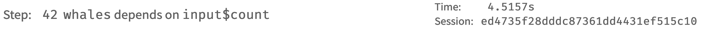
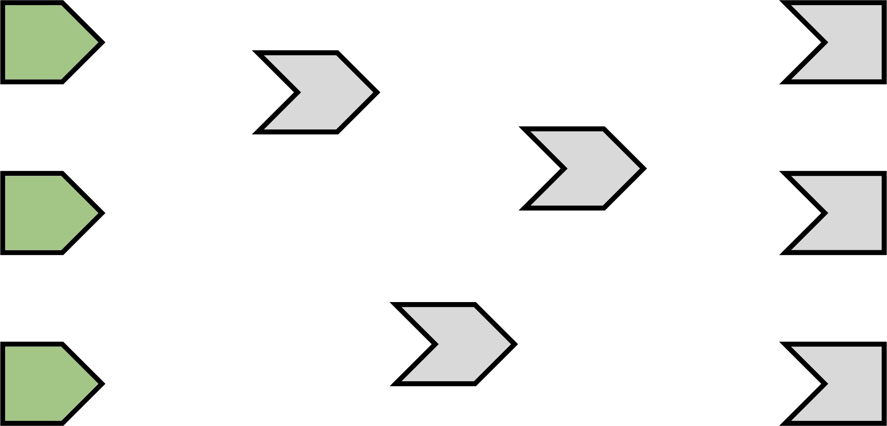
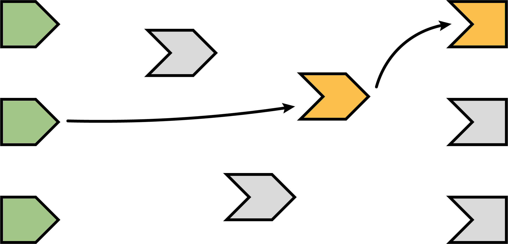
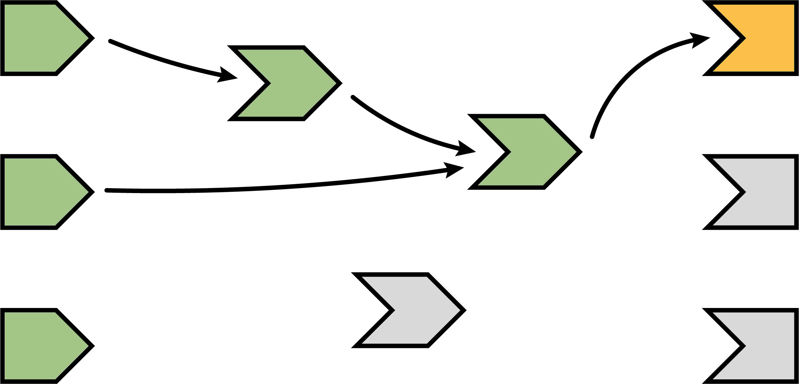
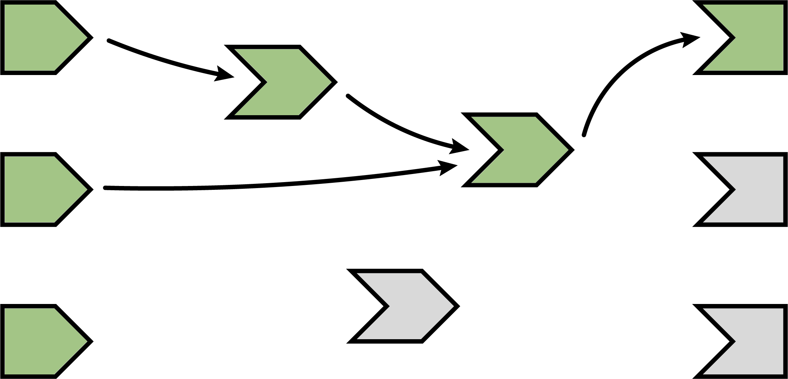
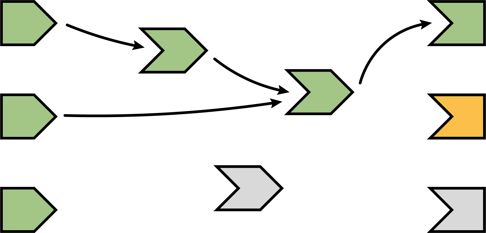

```{r setup, include = FALSE}
knitr::opts_chunk$set(
  collapse = TRUE,
  comment = "#>",
  fig.align="center",
  out.width="80%",
  echo = FALSE
)
```


# Resources

There are already many useful articles explaining what is reactive programming.  Here is a condensed set of links that I found to be useful while learning reactive programming.

* The core Shiny articles under [Build Reactivity](https://shiny.rstudio.com/articles/#reactivity): [https://shiny.rstudio.com/articles/#reactivity](https://shiny.rstudio.com/articles/#reactivity)
  * These articles help explain to me:
    * how reactive elements know about each other
    * when elements are calculated
    * why a `clientData` is randomly appearing in the reactive graph
    * how to prevent reactivity from executing using `isolate()`
* Shiny Tutorials: [https://shiny.rstudio.com/tutorial/](https://shiny.rstudio.com/tutorial/)
  * Treasure trove of useful tutorials, videos, and links to outside resources
* Effective Reactive Programming: [https://www.rstudio.com/resources/videos/effective-reactive-programming/](https://www.rstudio.com/resources/videos/effective-reactive-programming/)
  * "This tutorial will go beyond the basics, explaining the philosophy behind Shiny’s reactive programming framework and exploring patterns and techniques for using it well."
* [Mastering Shiny](https://github.com/jcheng5/shiny-book) by Joe Cheng


### Presentations

The updated reactlog was presented at `rstudio::conf2019`, titled "Reactlog 2.0: Debugging the State of Shiny."

* Presentation Repository: [https://github.com/schloerke/presentation-2019-01-18-reactlog](https://github.com/schloerke/presentation-2019-01-18-reactlog)
* Presentation Recording: [https://resources.rstudio.com/rstudio-conf-2019/reactlog-2-0-debugging-the-state-of-shiny](https://resources.rstudio.com/rstudio-conf-2019/reactlog-2-0-debugging-the-state-of-shiny)


# Reactlog

## Layout

The reactlog display is composed of two main parts: the status bar and the dependency graph.

```{r}
knitr::include_graphics("images/example_cranwhales.png")
```


### Status Bar

Located on the top of the screen, the status bar contains:

* navigation buttons
* progress bar
* current step information
* current execution time
* the session where the action is taking place
* and a search bar

```{r}
knitr::include_graphics("images/status_bar.png")
```

#### Navigation Buttons

The navigation buttons are used to jump around the recorded timeline of the reactlog graph.  There are four different ways to move time forwards and backwards within the reactlog.

```{r echo=FALSE,}
knitr::include_graphics("images/navigation.png")
```

* Previous / Next Step:  
  * These buttons move one reactive step a single step forwards (right) or backwards (left) within the displayed reactlog.
* Reactive Endpoint Calculation:  
  * These buttons advance the progress bar to the next (or previous) reactive endpoint (ex: output values or observe statements) that finishes it's calculation phase within the displayed reactlog.  These steps were deemed important as to highlight what has changed within the reactlog when advancing to the next reactive endpoint calculation.
* Idle Step:  
  * These buttons advance the progress bar to the next time the Shiny app has idled.  This means the application is not processing any information and is waiting for something within the application to be invalidated.  A relatively large time gap will most likely appear after this step.
* User Marked Step:  
  * These buttons advance the progress bar to the nearest user supplied mark.  These marks can be added using `Ctrl + F4` (Mac: `Cmd + F4`)

By default, reactlog will initially load to the last user mark.  If there are no user marks, the first reactive endpoint calculation will be loaded.

If next _jump_ location can not be found, the reactlog will advance to the end of the progress bar.  Likewise, if the previous _jump_ location can not be found, the reactlog will move to the beginning of the progress bar.

#### Progress Bar and Step Information

```{r}

```

The progress bar is composed of four main components: the current progress location, reactive endpoint marks, idle shiny application marks, and user defined marks.  Each of the marks are a visual representation of the corresponding locations.  The current progress bar will be displayed behind the marked steps to help signify where the reactive graph is currently being display within the reactlog recording.

```{r}

```

The current step information is displayed above the progress bar just after the navigation buttons. For each step within the reactlog, corresponding information is displayed.

To the left of the search bar is the Time and Session information.  The Time will display the relative time difference from the first recorded step.  The Session will display the Shiny session that the current step is being executed in.

##### Search Bar

The search bar is a live search bar that requires a minimum of three characters to begin searching.  All matches are found against the name or ID of each reactive graph element.  If no matches are found, the full graph is displayed.  All matching elements are increased in size to signify a match.  When searching for an element, all matching elements' family trees will be displayed.

Searching can be very useful to filter a large graph down to only the reactive elements involved in a calculation.

```{r, out.width="40%"}
knitr::include_graphics("images/search_bar.png")
```

> Pro tip: Use partial matching to filter the graph down to a particular module name.  The search above would look at the `input` values in the _details_ module.


### Dependency Graph

Once a reactlog has been recorded, all possible dependency connections are calculated to visually display which reactive elements are connected other reactive elements.  These possible connections will be displayed at all times to maintain graph structure and identify which elements will depend on other elements.  The directed, acyclic (typically) graph lays out the logical flow from left to right how reactive dependencies are invalidated and calculated.


#### Reactive Graph Nodes

```{r}

```

Reactive inputs are values that are the beginning of a reactive chain.  They are the leftmost starting points of the reactive graph.  Reactive sources are typically values created in `input`, `clientData`, `shiny::reactiveVal`, or `shiny::reactiveValues`.

Reactive expressions are conductors between sources and enpoints.  Their values depend on other reactive elements and are depended on by other reactive elements.  These expressions help with intermediate calculations, preventing duplicate calculations, and aid in logical flow.

Reactive endpoints are values that are being stored to the `output` object or are `observe`ing other reactive elements to produce side effects.

> Pro tip: Use the `label` parameter when defining reactive elements.  This will help your debug process and avoid long, code-exposing reactive element labels.

## Actions

#### Mouse

* Navigation Buttons
  * **Click**: Move to the next (or previous) appropriate step.
* Progress Bar:
  * **Click (+drag)**: Move to the step in the progress bar immediately.  This still works even if the targeted step is not in a filtered reactive graph.
* Reactive Element
  * **Hover**: Highlight the particular element's family tree within the graph.
  * **Click**: Maintain the highlighting of a particular element's family tree even after the mouse leaves the element.
  * **Double Click**: Subset the graph displayed to the family tree of the element clicked.

#### Keyboard Shortcuts

* Navigation
  * `Left/Right Arrow keys`: Left / Right a single Step.
  * `Left/Right Arrow keys + OPTION`: Move to the nearest Reactive Endpoint Calculation.
  * `Left/Right Arrow keys + OPTION + SHIFT`: Move to the nearest Idle Step.
  * `Home/End`: Move to the nearest User Marked Step or the beginning or end of the reactlog.

> Pro tip: Hold down the arrow keys to quickly iterate over all the steps of the displayed graph.

* `Esc`
  * If an element has been clicked, remove the click selection.
  * If the cursor focus is on the search bar, move the focus to the reactive graph.
  * If the focus is on the graph and the graph is filtered, reset the filter and display the whole graph.
* Reactlog Info
  * `s`: Move the focus to the **s**earch bar
  * `l`: When the cursor focus is on the graph, display the react**l**og step information.
  * `f`: Resize the graph to **f**it on the screen

## Reactive States

```{r, out.width="15%"}

```

Reactive elements will change their color throughout the reactlog.  At each stage of the reactlog, a reactive element can have one of the following states:

* Ready:
  * The reactive element has finished executing. For reactive conductors (such as the result of `reactive()`), a calculated value is available.
* Calculating:
  * The reactive element has started executing.  During calculation, direct dependencies will be added.
* Invalidating:
  * This is the opposite of calculating, the reactive element is resetting it's value and removing all direct dependencies.
* Invalidated:
  * The reactive element has been _reset_ and is waiting to calculate.
* Frozen:
  * A visual display of a frozen `reactiveVal` or `reactiveValues` key.  These elements behave as if their execution is done with `req(FALSE)`.  Please see [freezeReactiveValue](https://shiny.rstudio.com/reference/shiny/latest/freezeReactiveValue.html) for more information.
* Undefined:
  * Reactive elements that have not been defined at the current stage of the reactlog will appear white in color.  Their possible connections are maintained as a placeholder until the element is actually defined.

> Pro tip: `input` keys are not defined until they are relied on.  This may cause some `input` values to be defined later into the reactlog, even if the value was actually set at an earlier time point.


# Reactlog graph

> The following section has been modified (with permission) from Joe Cheng's chapter on Reactivity in his book, [Mastering Shiny](https://github.com/jcheng5/shiny-book)

## The reactive graph illustrated

Here's an illustrated version of a reactive graph.

```{r}

```

In the diagram above, the shapes on the left are reactive inputs and values, the ones in the middle are reactive expressions, and on the right are observers and outputs. (For the rest of this discussion, we'll simply refer to outputs as observers, rather than saying "observers and/or outputs" every time.)

The lines between the shapes are directional, with the arrows indicating the direction of reactivity--we'll see in a moment why this means the arrows go from left to right, instead of from right to left.

Now we'll follow along, step by step, as a Shiny app is loaded and these reactive relationships are discovered, formed, destroyed, and reformed.

### A session begins

When a reactive app is visited and a session begins, the server function is executed and the reactive objects are created. However, Shiny has no _a priori_ knowledge of the relationships (lines) between the objects. As you can see in the following diagram, the shapes are all present but there are no lines yet.

> The reactlog has a full history at render time, so an appropriate layout can be made on the initial display.

```{r}

```

Note that all of the reactive expressions and observers are a darker color. This indicates that they are in _invalidated_ state, which is the initial state for these objects. When an observer is in this state, it means it needs to be executed as soon as Shiny has a chance to. When a reactive expression is in this state, it means that the next time that reactive expression is read, its code will need to be executed (i.e., no result value is currently cached for that reactive expression).

### Execution begins

Now that the session has been initialized, we can begin the execution phase. In this phase, Shiny picks an observer (_not_ a reactive expression) and starts executing it. In the diagrams below, we use an orange fill to indicate when a node is actively executing.

```{r}

```

(You may wonder how Shiny decides which of the several invalidated observers/outputs to execute. The short answer is that you should act as if it's random. Ideally, your observers and especially outputs won't care what order they execute in, as each will function independently from the others. However, if you do have observers whose side effects must always happen in a certain relative order, you can use the `observe` function's `priority` argument to dictate that order for observers. You can also control the priority of outputs by calling the `outputOptions()` function with a `priority` argument.)

### Reading a reactive expression

During an observer's execution, it may read one or more reactive expressions. As soon as this occurs, a dependency/dependent relationship is established between the reactive expression and the observer, represented below by the arrow. The arrow points from left to right; this is the direction that reactivity will flow, as we'll see in a moment.

As we said, all reactive expressions start out in invalidated state (represented by the grey fill), including the one this observer is now trying to access. So in order to return a value, the reactive expression needs to execute its code, which it starts doing now. We fill the reactive expression with orange to represent that it's running.

Note that the observer is still orange: just because the reactive expression is now running, doesn't mean that the observer has finished. The observer is waiting on the reactive expression to return its value so its own execution can continue, just like a regular function call in R.

```{r}
knitr::include_graphics("images/04-reactivity/reactivity-graph-03.png")
```

### Reading an input

This particular reactive expression happens to read a reactive input. Again, a dependency/dependent relationship is established, so we add another arrow.

Unlike reactive expressions and observers, reactive inputs have nothing to execute, since they simply represent a variable.  This means their value is ready from the start.

```{r}

```

### Reactive expression completes

In our example, the reactive expression reads another reactive expression, which in turn reads another input. We'll skip over the blow-by-blow description of those steps, since they're just a repeat of what we've already described.

When the reactive expression has completed executing, it saves (caches) the resulting value internally before returning it to the observer that requested it. Now that the reactive expression has finished executing, it's no longer in invalidated (grey) or running (orange) state; rather, it's in idle/ready (green) state. When a reactive expression reaches this state, it means it's up-to-date and will not re-execute its code even if other reactive expressions or observers request its value. Instead, it can instantly return the value it cached during its most recent execution.

```{r}

```

### Observer completes

Now that the reactive expression has returned its value to the observer, the observer can complete executing its code. When this has completed, it too enters the idle state, so we change its fill color to green.

```{r}

```

### The next observer executes

Now that Shiny has completed execution of the first observer, it chooses a second one to execute. Again, it turns orange, and may read values from invalidated reactive expressions, which will turn orange, and so on. This cycle will repeat until every invalidated observer enters the idle/ready (green) state.

```{r}

```

### Execution completes, outputs flushed

At last, all of the observers have finished execution and are now idle. This round of reactive execution is complete, and nothing will happen with this session until some external force acts on the system (e.g. the user of the Shiny app moving a slider in the user interface). In reactive terms, this session is now at rest.

I didn't mention it before, but when Shiny outputs finish executing, they don't immediately update the output in the browser. Instead, all of the new outputs are held until this point, at which time they are "flushed" to the browser all at once. (It'd be nice if Shiny could let the app author decide whether outputs update one by one or all at once, but as of this writing, Shiny only supports the latter.)

```{r}
knitr::include_graphics("images/04-reactivity/reactivity-graph-08.png")
```

Let's stop here for just a moment and think about what we've done. We've read some inputs, calculated some values, and generated some outputs. But more importantly, in the course of doing that work, we also discovered the _relationships_ between these different calculations and outputs. An arrow from a reactive input to a reactive expression tells us that if the reactive input's value changes, the reactive expression's result value can no longer be considered valid. And an arrow from a reactive expression to an output means that if the reactive expression's result is no longer valid, then the output's previous result needs to be refreshed.

Just as important: we also know which nodes are _not_ dependent on each other. If no path exists from a particular reactive input to a particular output (always traveling in the direction that the arrows are pointing), then a change to that input couldn't possibly have an effect on that output. That gives us the ability to state with confidence that we don't need to refresh that output when that input changes, which is great--the less work we need to do, the sooner we can get results back to the user.

### An input changes

The previous step left off with our Shiny session in a fully idle state. Now imagine that the user of the application changes the value of a slider. This causes the browser to send a message to their server, instructing Shiny to update the corresponding reactive input.

When a reactive input or value is modified, it kicks off an _invalidation phase_, which we haven't seen up to this point. The invalidation phase starts at the changed input/value, which we'll fill with grey, our usual color for invalidation.

```{r}

```

### Notifying dependents

Now, we follow the arrows that we drew earlier. Each reactive expression and observer that we come across is put into invalidated state, then we continue following the arrows out of that node. As a refresher, for observers, the invalidated state means "should be executed as soon as Shiny gets a chance", and for reactive expressions, it means "must execute the next time its value is requested".

In this diagram, the arrows in the lighter shade indicate the paths we took from the changed reactive input through the reactive graph. Note that we can only traverse the arrows in their indicated direction; it's impossible to move from a reactive expression leftwards to a reactive input, for example.

```{r}

```

### Removing relationships

Next, each invalidated reactive expression and observer "erases" all of the arrows coming in or out of it. You can think of each arrow as a one-shot notification that will fire the next time a value changes. Not _every_ time, just _the next_ time. So all of the arrows coming _out_ of a reactive expression are safe to erase; like a used bottle rocket, they've fired their one shot.

(Less obvious is why we erase the arrows coming _in_ to an invalidated node, even if the node they're coming from isn't invalidated. While those arrows represent notifications that haven't yet fired, the invalidated node no longer cares about them. The only reason nodes care about notifications is so they can be invalidated; well, that invalidation has already happened due to some other dependency.)

```{r}
knitr::include_graphics("images/04-reactivity/reactivity-graph-11.png")
```

It may seem perverse that we put so much value on those relationships, and now we're going out of our way to erase them! But the truth is, though these particular arrows _were_ important, they are now themselves out of date. The only way to ensure that our graph stays accurate is to erase arrows when they become stale, and let Shiny rediscover the relationships around these nodes as they reexecute.

This marks the end of the invalidation phase.

### Reexecution

Now we're in a pretty similar situation to when the Shiny session first started; we have some invalidated reactive expressions and outputs, and we don't have any arrows coming in or out of them. It's time to do exactly what we did then: execute the invalidated outputs/observers, one at a time.

```{r}
knitr::include_graphics("images/04-reactivity/reactivity-graph-12.png")
```

What's different this time, though, is that not all of the reactive expressions and outputs are starting out in the invalidated state. Some parts of the graph weren't affected--neither directly nor indirectly--by the reactive input that had changed. That's great, as we won't need to reexecute those parts of the graph, even if they are used again by some of the invalidated parts!
