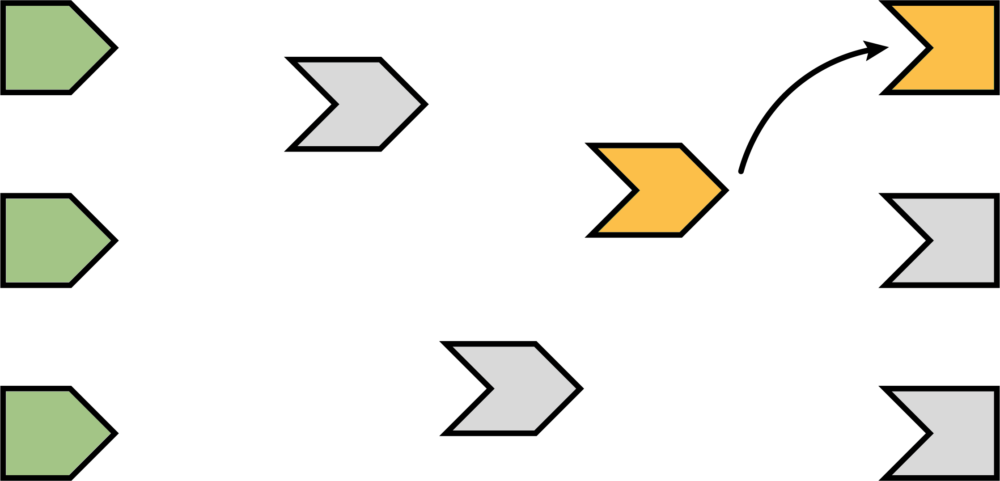
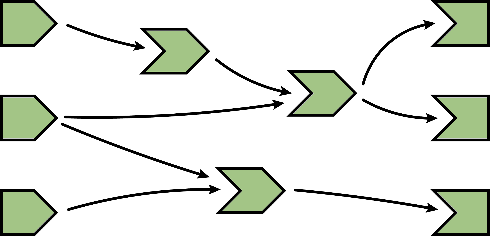
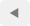
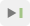

```{r setup, include = FALSE}
knitr::opts_chunk$set(
  collapse = TRUE,
  comment = "#>",
  fig.align="center",
  out.width="80%",
  echo = FALSE
)
```

## Background

With v0.14.0, the **shiny** R package introduced a way to investigate the activity and logic of a **shiny** application through a visualization of it's reactive history. In version v1.3.0, **shiny** revamped this visual tool via the R package **reactlog**. The design and capabilities of this interactive visualization have vastly improved, especially for navigating large and complex reactive graphs. This vignette outlines the new design and helps explain how to navigate the new interface.

To understand **reactlog**, it helps to have a basic understanding of **shiny**'s reactive programming model. If you're fairly new to **shiny** and reactive programming, the next section, which has been modified from the [_Mastering Shiny_ book by Joe Cheng](https://github.com/jcheng5/shiny-book), provides an overview of **shiny**'s reactivity model and is designed specifically for understanding **reactlog**. You'll notice the terminology, concepts, and graphics are consistent with **reactlog**, which is introduced in the [Hello Reactlog](#reactlog) section through code and video demonstrations. Heavy users of **reactlog** may find the [Reactlog in detail](#reactlog-in-detail) section helpful to detailing all the individual components of the **reactlog** interface. Finally, the [Learn more](#learn-more) section has links to more resources for learning even more about reactivity in **shiny**.

## The reactive lifecycle {#reactivity}

### A reactive graph

Below is a diagram of a reactive graph. The shapes on the left are reactive inputs (or values), the ones in the middle are reactive expressions, and on the right are observers (or outputs). The lines between the shapes are directional, with the arrows indicating the direction of their inter-dependencies. When a **shiny** app is loaded, this graph is discovered and formed. When a user interacts with the app and changes reactive input values, the graph is partially deconstructed and then reformed. The sub-sections that follow explain how this reactive lifecyle works in detail. The **reactlog** visualization is designed to help you inspect each particular step in this reactive lifecycle.

```{r}
knitr::include_graphics("images/04-reactivity/reactivity-graph-00.png")
```

### A session begins

When you load a **shiny** app, all reactive expression and observers begin in an _invalidated_ state (indicated in gray). Invalidated state essentially means that any code that the node depends upon needs to be re-executed.

```{r}
knitr::include_graphics("images/04-reactivity/reactivity-graph-01.png")
```

### Execution begins

After initializing a session, **shiny** picks an observer (_not_ a reactive expression) and starts executing it.^[You may wonder how Shiny decides which of the several invalidated observers/outputs to execute. The short answer is that you should act as if it's random. Ideally, your observers and especially outputs won't care what order they execute in, as each will function independently from the others. However, if you do have observers whose side effects must always happen in a certain relative order, you can use the `observe` function's `priority` argument to dictate that order for observers. You can also control the priority of outputs by calling the `outputOptions()` function with a `priority` argument.] Reactlog uses an orange fill to indicate when a node is actively executing (i.e., calculating).

```{r}
knitr::include_graphics("images/04-reactivity/reactivity-graph-02.png")
```

### Reading a reactive expression

During an observer's execution, it may read one or more reactive expressions. As soon as this occurs, the observer becomes dependent on the reactive expression, represented below by the new arrow.

Remember that all reactive expressions start out in invalidated state (represented by the grey fill), including the one this observer is now trying to access. In order to return a value, the reactive expression needs to execute its code, which it starts doing now. We fill the reactive expression with orange to represent that it's running.

Note that the observer is still orange: just because the reactive expression is now running, doesn't mean that the observer has finished. The observer is waiting on the reactive expression to return its value so its own execution can continue, just like a regular function call in R.

```{r}

```

### Reading an input

This particular reactive expression happens to read a reactive input. Therefore, the reactive expression depends on the input, represented below by the arrow.

Unlike reactive expressions and observers, reactive inputs simply hold a value, so they don't require an execution phase (i.e., their value is ready from the start).

```{r}
knitr::include_graphics("images/04-reactivity/reactivity-graph-04.png")
```

### Reactive expression completes

In our example, the reactive expression reads another reactive expression, which in turn reads another input. We'll skip over the blow-by-blow description of those steps, since they're just a repeat of what we've already described.

When the reactive expression has completed executing, it saves (caches) the resulting value internally before returning it to the observer that requested it. Now that the reactive expression has finished executing, it's no longer in invalidated (grey) or running (orange) state; rather, it's in idle/ready (green) state. When a reactive expression reaches this state, it means it's up-to-date and will not re-execute its code even if other reactive expressions or observers request its value. Instead, it can instantly return the value it cached during its most recent execution.

```{r}
knitr::include_graphics("images/04-reactivity/reactivity-graph-05.png")
```

### Observer completes

Now that the reactive expression has returned its value to the observer, the observer can complete executing its code. When this has completed, it too enters the idle state, so we change its fill color to green.

```{r}
knitr::include_graphics("images/04-reactivity/reactivity-graph-06.png")
```

### The next observer executes

Now that Shiny has completed execution of the first observer, it chooses a second one to execute. Again, it turns orange, and may read values from reactive expressions, which will turn orange, and so on. This cycle will repeat until every invalidated observer enters the idle/ready (green) state.

```{r}
knitr::include_graphics("images/04-reactivity/reactivity-graph-07.png")
```

> As shown in the next diagram, the second observer in this particular graph depends on an idle reactive expression, so it can simply access it's cached value without performing redundant and possibly costly re-execution.

### Execution completes, outputs flushed {#reactive-flush}

At last, all of the observers have finished execution and are now idle. This round of reactive execution is complete, and nothing will happen with this session until some external force acts on the system (e.g. the user of the Shiny app moving a slider in the user interface). In reactive terms, this session is now at rest.

```{r}

```

Let's stop here for just a moment and think about what we've done. We've read some inputs, calculated some values, and generated some outputs. But more importantly, in the course of doing that work, we also discovered the _relationships_ between these different calculations and outputs. An arrow from a reactive input to a reactive expression tells us that if the reactive input's value changes, the reactive expression's result value can no longer be considered valid. And an arrow from a reactive expression to an output means that if the reactive expression's result is no longer valid, then the output's previous result needs to be refreshed.

Just as important: we also know which nodes are _not_ dependent on each other. If no path exists from a particular reactive input to a particular output (always traveling in the direction that the arrows are pointing), then a change to that input couldn't possibly have an effect on that output. That gives us the ability to state with confidence that we don't need to refresh that output when that input changes, which is great--the less work we need to do, the sooner we can get results back to the user.

### An input changes

The previous step left off with our Shiny session in a fully idle state. Now imagine that the user of the application changes the value of a slider. This causes the browser to send a message to their server, instructing Shiny to update the corresponding reactive input.

When a reactive input or value is modified, it kicks off an _invalidation phase_, which we haven't seen up to this point. The invalidation phase starts at the changed input/value, which we'll fill with grey, our usual color for invalidation.

```{r}
knitr::include_graphics("images/04-reactivity/reactivity-graph-09.png")
```

### Notifying dependents

Now, we follow the arrows that we drew earlier. Each reactive expression and observer that we come across is put into invalidated state, then we continue following the arrows out of that node. As a refresher, for observers, the invalidated state means "should be executed as soon as Shiny gets a chance", and for reactive expressions, it means "must execute the next time its value is requested".

In this diagram, the arrows in the lighter shade indicate the paths we took from the changed reactive input through the reactive graph. Note that we can only traverse the arrows in their indicated direction; it's impossible to move from a reactive expression leftwards to a reactive input, for example.

```{r}
knitr::include_graphics("images/04-reactivity/reactivity-graph-10.png")
```

### Removing relationships

Next, each invalidated reactive expression and observer "erases" all of the arrows coming in or out of it. You can think of each arrow as a one-shot notification that will fire the next time a value changes. Not _every_ time, just _the next_ time. So all of the arrows coming _out_ of a reactive expression are safe to erase; like a used bottle rocket, they've fired their one shot.

(Less obvious is why we erase the arrows coming _in_ to an invalidated node, even if the node they're coming from isn't invalidated. While those arrows represent notifications that haven't yet fired, the invalidated node no longer cares about them. The only reason nodes care about notifications is so they can be invalidated; well, that invalidation has already happened due to some other dependency.)

```{r}

```

It may seem perverse that we put so much value on those relationships, and now we're going out of our way to erase them! But the truth is, though these particular arrows _were_ important, they are now themselves out of date. The only way to ensure that our graph stays accurate is to erase arrows when they become stale, and let Shiny rediscover the relationships around these nodes as they reexecute.

This marks the end of the invalidation phase.

### Reexecution

Now we're in a pretty similar situation to when the Shiny session first started; we have some invalidated reactive expressions and outputs, and we don't have any arrows coming in or out of them. It's time to do exactly what we did then: execute the invalidated outputs/observers, one at a time.

```{r}

```

What's different this time, though, is that not all of the reactive expressions and outputs are starting out in the invalidated state. Some parts of the graph weren't affected--neither directly nor indirectly--by the reactive input that had changed. That's great, as we won't need to reexecute those parts of the graph, even if they are used again by some of the invalidated parts!


## Hello Reactlog {#reactlog}

Consider the following **shiny** app with one reactive input and one output. It simply allows you to choose variables from the `diamonds` dataset to visualize that variable using **plotly**.

```r
options(shiny.reactlog = TRUE)

library(shiny)
library(plotly)

ui <- fluidPage(
  selectInput("var", "Choose a variable", choices = names(diamonds)),
  plotlyOutput("p")
)

server <- function(input, output, session) {
  output$plot <- renderPlotly({
    plot_ly(x = diamonds[[input$var]])
  })
}

shinyApp(ui, server)
```

The following video demonstrates how one could run this application, interact with it (i.e., choose a different variable), then launch the react log by pressing Ctrl+F3 (Mac: Cmd+F3). To start at the very beginning of the app's lifecycle, click the  button. You can then navigate through each step of the reactive lifecyle by pressing the right arrow key or clicking . As you step through the lifecycle, notice how the status of the graph is displayed above the dependency graph. A breakdown of all the components of the status bar is provided in the [Status bar](#status-bar) section.

```{r}
htmltools::tags$iframe(
  src = "https://player.vimeo.com/video/321628235?title=0&byline=0&portrait=0",
  width = "100%",
  height = 400,
  frameborder = "0",
  seamless = "seamless",
  webkitAllowFullScreen = NA,
  mozallowfullscreen = NA,
  allowFullScreen = NA
)
```

For more complex graphs, like the one created by [Joe Cheng's cranwhales app](https://github.com/jcheng5/cranwhales), it's convenient to have more advanced navigation through the time-dependent graph, like jumping to the next idle step using , and querying sub-graphs by double-clicking and/or searching for graph components by name. Also, notice how, upon opening **reactlog**, it navigates to the first [reactive flush](#reactive-flush) (i.e., completion of the first round of reactive execution). If there is a particular round of execution you're primarily interested in, you can add user mark(s), and **reactlog** would open to that time point instead (see [Navigation](#navigation-buttons) for more details on creating and navigating to user marks).

```r
options(shiny.reactlog = TRUE)
shiny::runGitHub("cranwhales", "jcheng5", ref = "sync")
```

```{r}
htmltools::tags$iframe(
  src = "https://player.vimeo.com/video/321805975?title=0&byline=0&portrait=0",
  width = "100%",
  height = 400,
  frameborder = "0",
  seamless = "seamless",
  webkitAllowFullScreen = NA,
  mozallowfullscreen = NA,
  allowFullScreen = NA
)
```

These two videos demonstrate basic navigation of the **reactlog** interface. Next we'll explain all the components in detail.

## Reactlog in detail {#reactlog-in-detail}

The **reactlog** visualization consists of two main components: the [status bar](#status-bar) and [dependency graph](#dependency-graph).

```{r, out.width="100%"}

```

### Status Bar {#status-bar}

The status bar appears above the dependency graph and contains information about the current state of the graph. The status bar is comprised of the progress bar, current step information, navigation buttons, and a search bar.

```{r, out.width="100%"}

```

#### Progress Bar

The progress bar is composed of four main components: the current progress location (dark gray rectangle), reactive endpoint marks (short green line), idle shiny application marks (tall green line), and user defined marks (tall gray line). Notice that the progress bar location reflects the current 'step' in the formation of the reactive graph which may or may not be in line with a endpoint/idle/user mark. You can navigate to any particular step of the progress bar by directly clicking or using the [navigation buttons](#navigation-buttons) (or key-bindings).

```{r, out.width="100%"}
knitr::include_graphics("images/progress_bar.png")
```

#### Current step

Information about the current step appears above the progress bar and provides information about the current state of the reactive graph formation. The step description makes a direct reference to stages of the [The reactive lifecycle](#reactivity). The time information displays the relative time difference between the current step and from the first recorded step.^[**reactlog** is not designed to be a code profiling tool. If you are curious why your app is slow, use [the **profvis** package](https://rstudio.github.io/profvis/) to identify and address slow R code.] The Session will display the Shiny session ID that the current step is being executed in. The session ID can potentially be of interest if your shiny app is serving multiple users.

```{r}
knitr::include_graphics("images/step_information.png")
```

> Pro tip: Press the 'l' key to display even more detailed information about the current step.

#### Navigation Buttons {#navigation-buttons}

The navigation buttons are used to jump around the recorded timeline of the reactlog graph.  There are four different ways to move time forwards and backwards within the reactlog.

```{r echo=FALSE,}

```

* Previous / Next Step (`Left/Right Arrow keys`):  
  * These buttons move one reactive step a single step forwards (right) or backwards (left) within the displayed reactlog.
* Reactive Endpoint Calculation (`Left/Right Arrow keys + OPTION`):  
  * These buttons advance the progress bar to the next (or previous) reactive endpoint (ex: output values or observe statements) that finishes it's calculation phase within the displayed reactlog.  These steps were deemed important as to highlight what has changed within the reactlog when advancing to the next reactive endpoint calculation.
* Idle Step (`Left/Right Arrow keys + OPTION + SHIFT`):  
  * These buttons advance the progress bar to the next time the Shiny app has idled.  This means the application is not processing any information and is waiting for something within the application to be invalidated.  A relatively large time gap will most likely appear after this step.
* User Marked Step (`Home/End`):  
  * These buttons advance the progress bar to the nearest user supplied mark. These marks can be added by pressing `Ctrl + F4` (Mac: `Cmd + F4`) inside the **shiny** application.

> Tip: Hold down the arrow keys to quickly iterate over all the steps of the displayed graph.

##### Search Bar

The search bar matches the name or ID of each reactive graph element. All matching elements are increased in size to signify a match and all matching elements' family trees are displayed. The search becomes active after three characters, and if no matches are found, the full graph is displayed.

```{r, out.width="40%"}

```

> Tip 1: Use partial matching to filter the graph down to a particular module name. The search above would look at the `input` values in the _details_ module.

> Tip 2: Press the 's' key to bring focus to the search bar.


### Dependency Graph {#dependency-graph}

**Reactlog** always displays every dependency that was made at any point in time during the recorded lifecycle. This helps maintain graph structure (i.e., [object constancy](https://bost.ocks.org/mike/constancy/)) when stepping through the lifecycle and also to identify which nodes will depend on other nodes. To reflect the current reactive state, **reactlog** color encodes each graph node as well as dimmed arrows to denote dependencies that are yet to be established.

#### Reactive States

```{r, out.width="15%"}
knitr::include_graphics("images/legend.png")
```

At each stage of the reactlog, a reactive element can have one of the following states:

* Ready:
  * The reactive element has finished executing. For reactive conductors (such as the result of `reactive()`), a calculated value is available.
* Calculating:
  * The reactive element has started executing.  During calculation, direct dependencies will be added.
* Invalidating:
  * This is the opposite of calculating, the reactive element is resetting it's value and removing all direct dependencies.
* Invalidated:
  * The reactive element has been _reset_ and is waiting to calculate.
* Frozen:
  * A visual display of a frozen `reactiveVal` or `reactiveValues` key.  These elements behave as if their execution is done with `req(FALSE)`.  Please see [freezeReactiveValue](https://shiny.rstudio.com/reference/shiny/latest/freezeReactiveValue.html) for more information.
* Undefined:
  * Reactive elements that have not been defined at the current stage of the reactlog will appear white in color.  Their possible connections are maintained as a placeholder until the element is actually defined.

> Pro tip: `input` values are not defined until they are relied on.  This may cause some `input` values to be defined later into the reactlog, even if the value was actually set at an earlier time point.


#### Highlighting and filtering

Hovering over a particular graph element (either a node or an edge) highlights that element's family tree. A single click maintains that highlighting. Double-clicking filters the graph to that element's family tree. To clear any highlight/filter selections, click/double-click the background of the graph or press the `Esc` key when the graph is in focus.

```{r}
htmltools::tags$iframe(
  src = "https://player.vimeo.com/video/321837450?title=0&byline=0&portrait=0",
  width = "100%",
  height = 400,
  frameborder = "0",
  seamless = "seamless",
  webkitAllowFullScreen = NA,
  mozallowfullscreen = NA,
  allowFullScreen = NA
)
```

#### Zooming

When the graph is in focus, you can scroll the mouse to zoom in on the graph -- also, press the 'f' key to alter the zoom so that the current graph fits the screen.

#### Labeling nodes

Recall from [the reactive lifecycle](#reactivity) that nodes in a reactive graph encode reactive inputs, expressions, and outputs (or observers). Labeling inputs and outputs is relatively straight-forward since they already have an associated ID. Reactive expression and observers, on the other hand, don't have an associated ID -- **reactlog**, by default, will use the body of the expression to label these nodes.

```{r}
knitr::include_graphics("images/elements.png")
```


Fortunately, **shiny**'s `reactive()` and `observe()` functions have a `label` argument. If provided, **reactlog** will use this value to label the corresponding nodes.

## Learn more {#learn-more}

This vignette explains the **reactlog** inferface, which requires a basic understanding of **shiny** and reactive programming. There are many other useful existing articles and resources that may help advance your understanding of **reactlog** and **shiny**, including but not limited to:

* The core **shiny** articles under [Build Reactivity](https://shiny.rstudio.com/articles/#reactivity), these articles help explain:
    * How reactive elements know about each other
    * When elements are calculated
    * Why a `clientData` is randomly appearing in the reactive graph
    * How to prevent reactivity from executing using `isolate()`
* The **shiny** [tutorials](https://shiny.rstudio.com/tutorial/), which provides many great instructional videos and various learning resources.
* The `rstudio::conf2019` talk by Barret Schloerke: _Reactlog 2.0: Debugging the State of Shiny_ ([Video](https://resources.rstudio.com/rstudio-conf-2019/reactlog-2-0-debugging-the-state-of-shiny) / [Slides](https://github.com/schloerke/presentation-2019-01-18-reactlog/blob/master/rstudio-conf-2019-reactlog.pdf)).
* Effective Reactive Programming: [https://www.rstudio.com/resources/videos/effective-reactive-programming/](https://www.rstudio.com/resources/videos/effective-reactive-programming/)
  * "This tutorial will go beyond the basics, explaining the philosophy behind Shiny’s reactive programming framework and exploring patterns and techniques for using it well."
* [Mastering Shiny](https://github.com/jcheng5/shiny-book) by Joe Cheng
